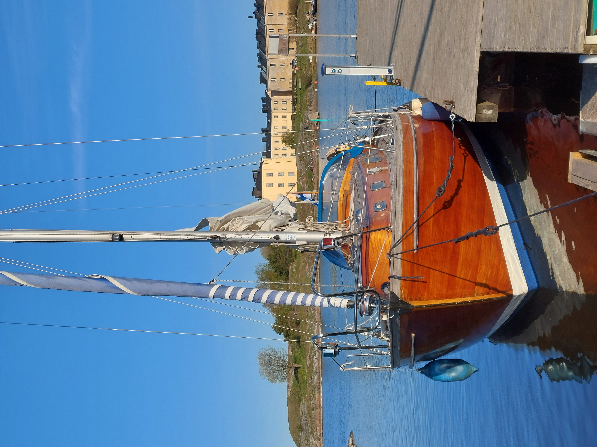
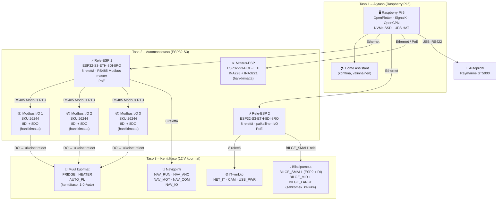
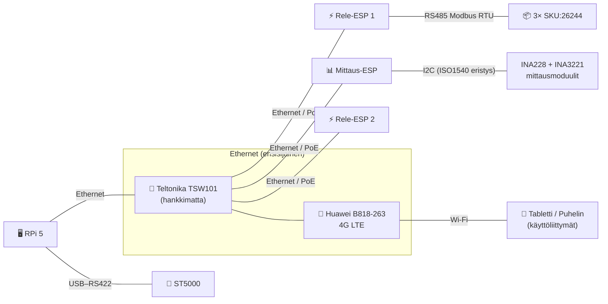
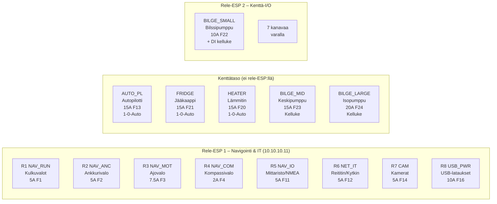
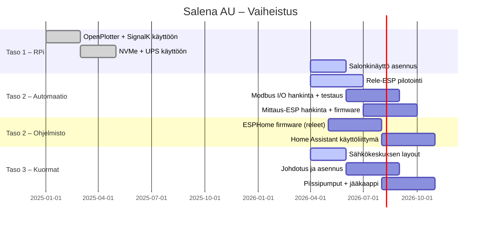

# Salena AU – Projektin yleiskatsaus

**Päivitetty:** 04/2026 · **Versio:** v5.1.0  
**Vene:** Amigo 40 "Salena" (mahonki, 1977)

---

## Vene

Salena on mahongista valmistettu Amigo 40, rakennettu vuonna 1977 prototyypiksi
lasikuitusarjalle. Sähköjärjestelmä on lähes alkuperäinen. Salena AU -projekti
tuo sen 2020-luvulle.

---

## Järjestelmäarkkitehtuuri

---

## Verkko ja väylät

---

## Komponenttistatus

| Komponentti | Tunnus / Malli | Tila |
|:---|:---|:---:|
| Raspberry Pi 5 (8 GB) | RPi 5 | ✅ Käytössä |
| NVMe HAT+ | WS-27709 | ✅ Käytössä |
| NVMe SSD | 256/512 GB | ✅ Käytössä |
| UPS HAT (E) | WS-27966 | ✅ Käytössä |
| RS422→USB-adapteri | ST5000 | ✅ Hankittu |
| Reititin | Huawei B818-263 | ✅ Käytössä |
| Mastokamera | Tapo C500 | ✅ Hankittu |
| Salonkinäyttö | Blackstorm M245BN 24.5" | ✅ Hankittu |
| Rele-ESP 1 | ESP32-S3-ETH-8DI-8RO | ✅ Hankittu |
| Rele-ESP 2 | ESP32-S3-ETH-8DI-8RO | ✅ Hankittu |
| Kytkin | Teltonika TSW101 | ❌ Hankkimatta |
| Mittaus-ESP | SKU:28771 / ESP32-S3-POE-ETH | ❌ Hankkimatta |
| Modbus I/O 1 | Waveshare SKU:26244 | ❌ Hankkimatta |
| Modbus I/O 2 | Waveshare SKU:26244 | ❌ Hankkimatta |
| Modbus I/O 3 | Waveshare SKU:26244 | ❌ Hankkimatta |
| Pääakun shuntti | HoFL2-250A-50mV-0.1% | ❌ Hankkimatta |
| Pienkuormashuntit | 3× HoFL2-20A-75mV-0.1% | ❌ Hankkimatta |
| INA228-moduuli | MIKROE-4810 | ❌ Hankkimatta |
| INA3221-moduuli | MIKROE-4126 | ❌ Hankkimatta |
| I2C-erotin | MIKROE-1878 (ISO1540) | ❌ Hankkimatta |
| Aurinkopaneelit (3 × 50 W) | Victron BlueSolar + taivutettava | ✅ Asennettu |
| MPPT-säätimet | Victron SmartSolar 75/15 | ❌ Hankkimatta |
| DC-DC laturi (brain-akku) | Victron Orion-Tr Smart 12/12-18A | ✅ Asennettu |
| Pääkytkin + ACR | Blue Sea 7649 | ✅ Asennettu |
| Autopilotti | Raymarine ST5000 | ✅ Käytössä |
| Jääkaappi | Danfoss kompressori | ❌ Hankkimatta |
| Lämmitin | VEVOR 5 kW Diesel | ❌ Hankkimatta |
| Bilssipumput (3 kpl) | BILGE_SMALL/MID/LARGE | ❌ Hankkimatta |
| PIR-ilmaisimet (3 kpl) | Paradox NV5MF / Bosch | ❌ Hankkimatta |

---

## Ohjelmistostatus

| Ohjelmisto | Alusta | Tila |
|:---|:---|:---:|
| OpenPlotter | RPi 5 | ✅ Käytössä |
| SignalK | RPi 5 | ✅ Käytössä |
| OpenCPN + Suomen merikartat | RPi 5 | ✅ Käytössä |
| Home Assistant (kontti) | RPi 5 | ❌ Ei tuotannossa |
| Mosquitto MQTT (kontti) | RPi 5 | ❌ Ei tuotannossa |
| Rele-ESP firmware (ESPHome) | Rele-ESP 1 & 2 | ❌ Tekemättä |
| Mittaus-ESP firmware | Mittaus-ESP | ❌ Tekemättä |

---

## Relekartta (yhteenveto)

---

## Projektin eteneminen

---

## Suunnitteluperiaatteet (tiivistelmä)

| Periaate | Kuvaus |
|:---|:---|
| 🔒 Manuaalinen fallback | Vene toimii täysin ilman automaatiota |
| 🌐 Ei pilviriippuvuutta | Järjestelmä toimii paikallisesti |
| 🔁 Kerroksellinen arkkitehtuuri | Navigointi, automaatio ja kuormat erotettu |
| 🔌 Ethernet ensisijaisena | Wi-Fi vain käyttöliittymille |
| 🔧 Huollettavuus | Selkeät kytkennät, sulakkeet, dokumentointi |
| 📈 Vaiheittainen laajennus | Lisäykset ilman uudelleensuunnittelua |

---

## Viitteet

- [Järjestelmäarkkitehtuuri](architecture.md)
- [Nykytila](current_state.md)
- [Suunnittelupäätökset](design_decisions.md)
- [Verkko ja väylät](network.md)
- [Hankinnat](procurement.md)
- [Relekartta](../hardware/relay_map.md)
- [Akut, laturit ja paneelit](../hardware/power-setup.md)
- [TODO](todo.md)
